<h1>📚 Orgbooks - Gerenciador de Livros Didáticos</h1>

<h4>O Orgbooks foi feito com o intuíto de auxiliar os docentes da instituição Etec Philadelpho Gouvêa Netto no manejo dos livros didáticos da escola. Através de um gerador de QRCode's é possível identificar os livros por unidade e, de forma simplicada, escaneá-los com o scanner da própria plataforma. Além disso, conta com uma aba de empréstimos, para que possa ser realizado o empréstimo de livros à discentes. A aba de overview serve como "visão geral" do sistema. É possível exportar informações, visualizar notificações, calendário de empréstimos, perfis de alunos, edições de livros, etc.</h4>

 

<ul><li><h2>✨ Features:</h2></li></ul>

 ✔️ Aplicação responsiva 

 ✔️ Composer como gerenciador de pacotes 

 ✔️ Uso da biblioteca php-qrcode para identificação dos livros didáticos 

 ✔️ Uso da biblioteca Apexcharts.js e FullCalendar.js na aba overview 

 ✔️ Uso de um scanner de qrcode para scanning dos livros e realização de empréstimos 

 ✔️ Overview geral dos empréstimos e livros registrados na base de dados 

 ✔️ CRUD de livros, edições, empréstimos e alunos 
  
 

<ul><li><h2>Telas:</h2></li></ul>

  <h3 align="center">Login:</h3>
  

    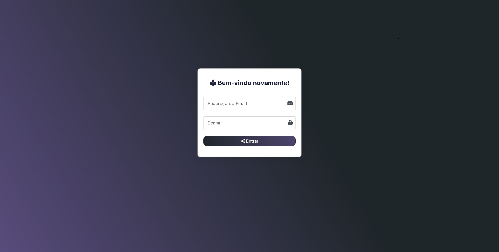
  

  <h3 align="center">Overview:</h3>
  

    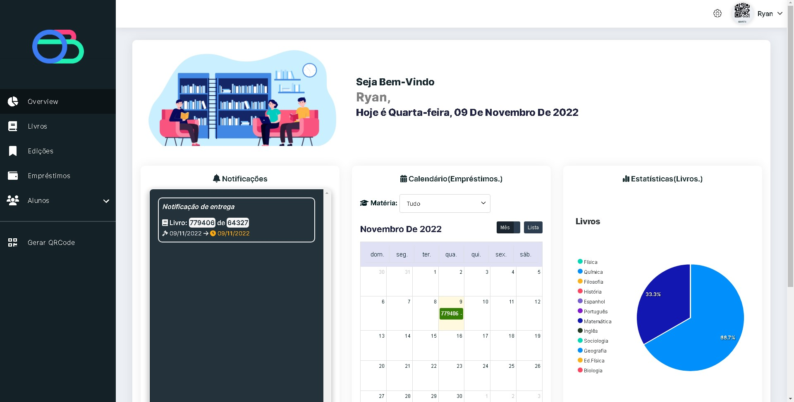
  

 

  <h3 align="center">Loading:</h3>
  

    
  

 

  <h3 align="center">Configuração de interface:</h3>
  

    
  

 

  <h3 align="center">Perfil:</h3>
  

    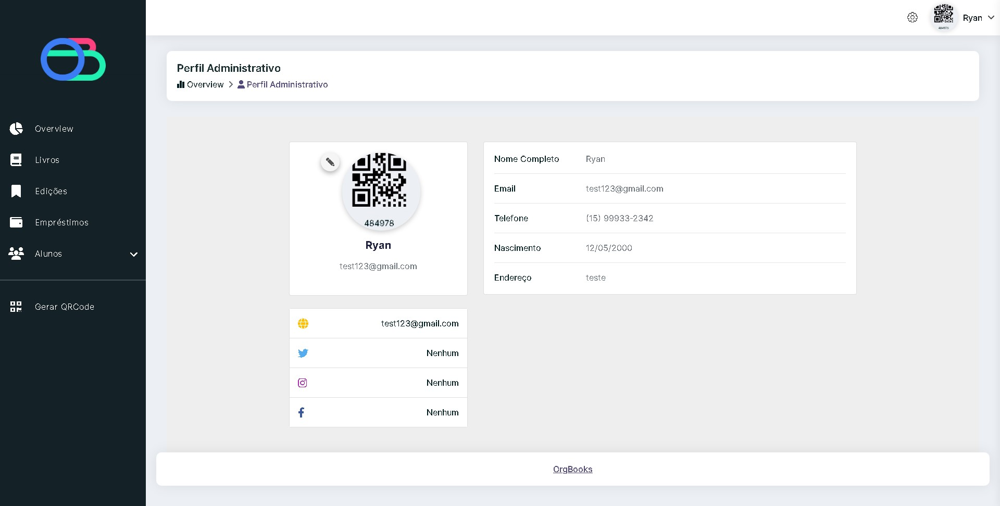
  

  

  <h3 align="center">Edições:</h3>
  

    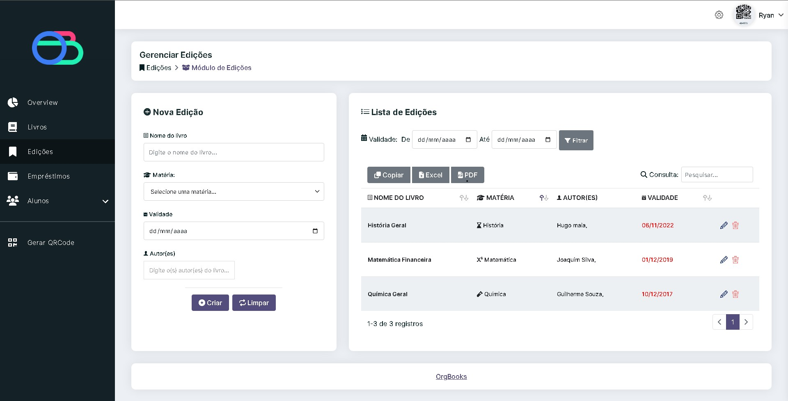
  

  

  <h3 align="center">Editar Edição:</h3>
  

    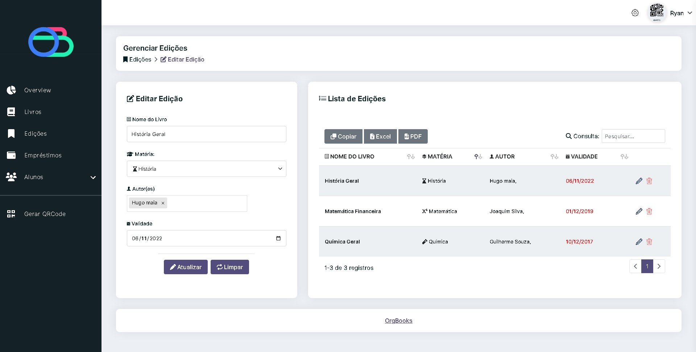
  

  

  <h3 align="center">Livros:</h3>
  

    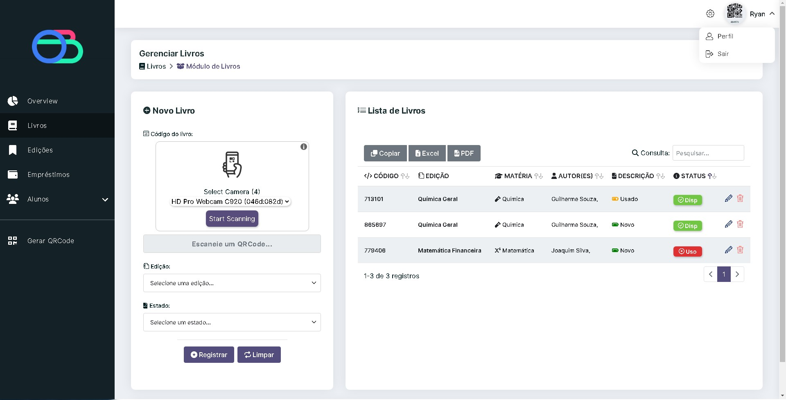
  

  

  <h3 align="center">Editar Livro:</h3>
  

    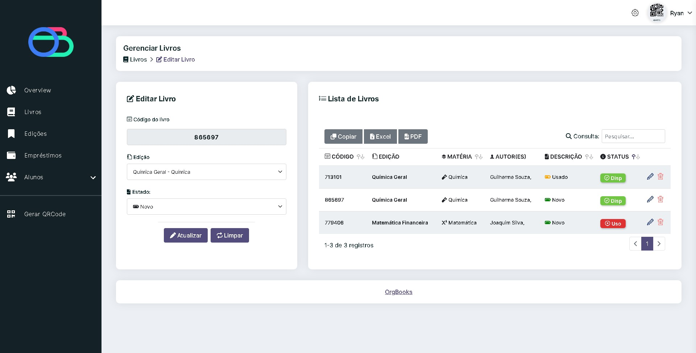
  

  

  <h3 align="center">Empréstimos:</h3>
  

    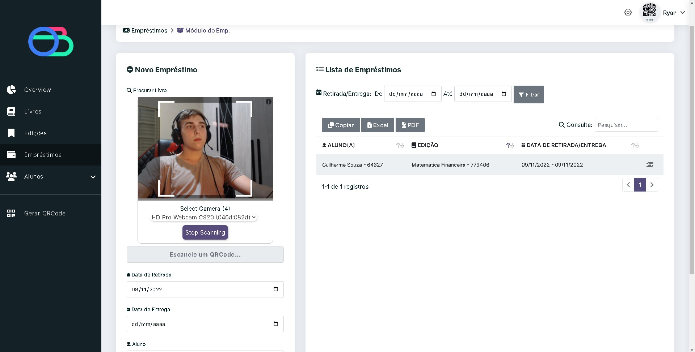
  

  

  <h3 align="center">Alunos:</h3>
  

    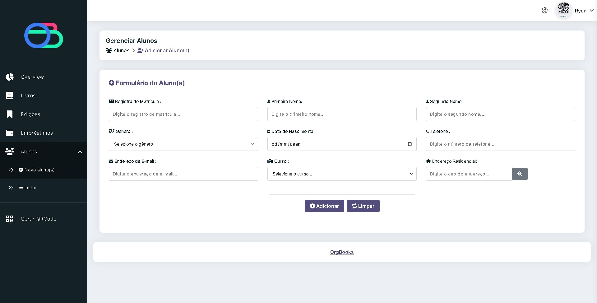
  

 

  <h3 align="center">Listar Alunos:</h3>
  

    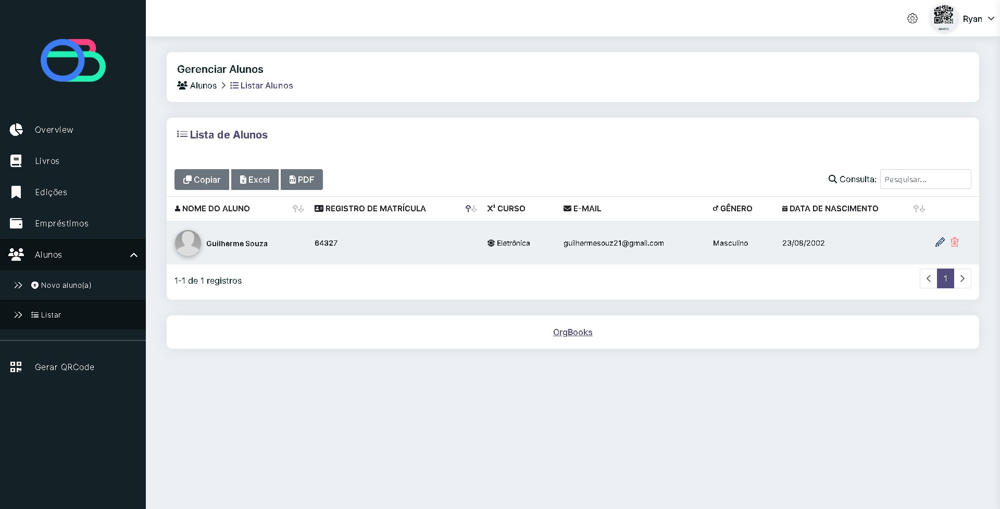
  

  

  <h3 align="center">Editar Aluno:</h3>
  

    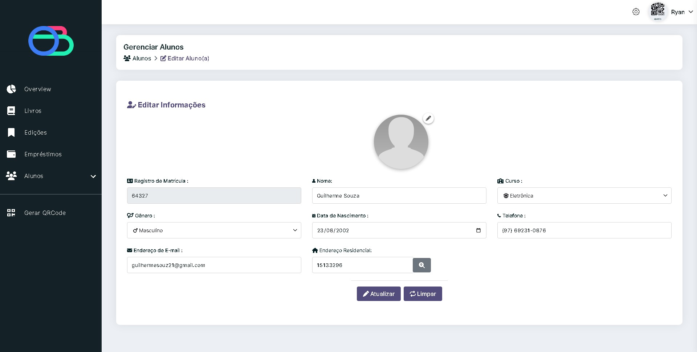
  

  

  <h3 align="center">Gerar QRCode:</h3>
  

    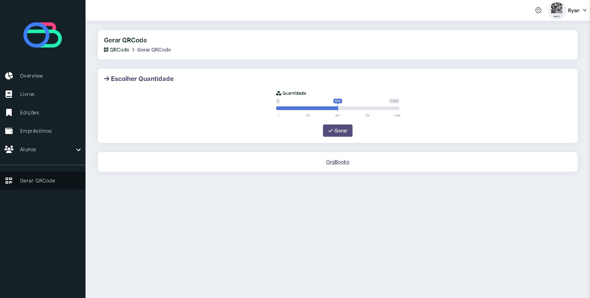
  

